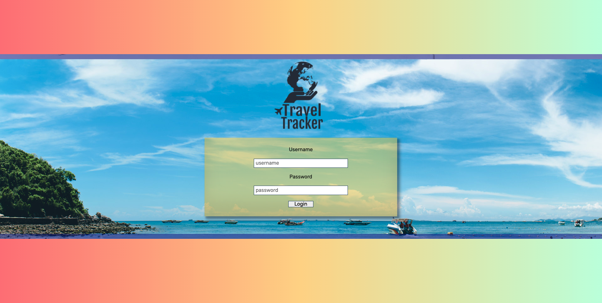

# Travel Tracker

A hosted [web application](https://pcmueller.github.io/travel-tracker/) to cost, track, and book trips for individual travelers.

1. [Images](#images)
2. [Demonstrations](#demonstrations)
3. [Login](#walkthrough)
4. [Functionality](#functionality)
5. [Installation](#installation)
6. [Technologies](#technologies)
7. [Contributors](#contributors)
8. [Links](#resources)

## Images

### Login Page View

### Home View

## Demonstrations

### Booking & Navigation

### Trip Card Responsiveness

## Login
* To login to the page, type in the word "traveler" + any two-digit number, 01 - 50 (e.g. 'traveler06').
* Type in the password - `travel2020` - and click the login button.
* You'll then be taken to the home page and greeted by the name of the user you've selected, with that user's travel data displayed.

## Functionality

* In the page header, the user's "Annual Travel Costs" are instantly calculated and displayed in the upper right corner.
* Below that is a "Logout" button, which can be clicked at any time to clear the "traveler" data and return a user back to the login page.
* In the center is a nav bar with four buttons: *Current Trips*, *Upcoming Trips*, *Previous Trips*, and *Pending Trips*, each toggling the display of the appropriate collection of "trip cards" below.
* On the left end of the header is a Travel Tracker company logo, which has been activated as a "Home" button and can be clicked to take the user back to same "My Trips" view displayed on initial page load.
* Below the header is an interactive "Plan Your Next Adventure" section, through which a user can book a new trip.
* This section is completely navigable via keyboard, and contains four required input fields:
  - *Select Destination*: drop-down menu containing a list of all possible travel destinations, a dynamic list that auto-populates on page load.
  - *Departure Date*: drop-down calendar menu allowing a user to select the first date of their trip.  Since our "trips" dataset is comprised entirely of past dates, the calendar starts in 2019, and the user can book as far out as 2035.
  - *Duration of trip*: input box (with clickable arrow to increment/decrement value) to type or select the trip length, represented in number of days.
  - *Number of travelers*: input box (with clickable arrow to increment/decrement value) to type or select the trip length in number of days.
* Once all four fields have been filled out, the user can click two different buttons to process this information:
  - *Estimate Trip Cost*: will display a modal window with the estimated cost of this trip, including airfare, lodging and the 10% agent fee.
  - *Book Trip*: submit the trip request by posting data to the API with a trip status of "pending", requiring the agent's approval.
* The trip is then automatically loaded into the "My Trips" view, and a modal window pops-up to notify the user of their successful booking, with the message including both the destination name and the estimated trip cost.
* Error Handling: several error messages have been built into the data functionality, utilizing accessiblity-friendly modal windows to display: unsuccessful GET and POST requests to the API, incomplete form selections (when clicking either booking button), and invalid username or password submission on the login page.

## Installation

* Clone down remote repository by entering `git clone git@github.com:pcmueller/travel-tracker.git` in console
* Use command `cd` to navigate into new `travel-tracker` directory
* Install repository dependencies using `npm i`
* Initialize webpack server using command `npm start`
* Clone down `travel-tracker-api` by following [these instructions](https://github.com/turingschool-examples/travel-tracker-api)
* Navigate to cloned API directory 
* Initialize Express server using command `npm start`
* Access application in your browser at using this [local server](http://localhost:8080/)

## Technologies

1. HTML
2. CSS/Sass
3. JavaScript
4. Express
5. Webpack
6. Mocha & Chai
7. GitHub

## Contributors

* Developer: [🦥 Peter Muellerleile](https://github.com/pcmueller)
* Project Manager: [🎓 Travis Rollins](https://github.com/Kalikoze)

## Links

* [Project Specifications](https://frontend.turing.edu/projects/travel-tracker.html)
* [GitHub Repo](https://github.com/pcmueller/travel-tracker)
* [GitHub Hosted Page](https://pcmueller.github.io/travel-tracker/)
